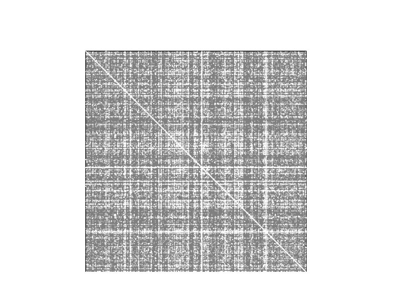
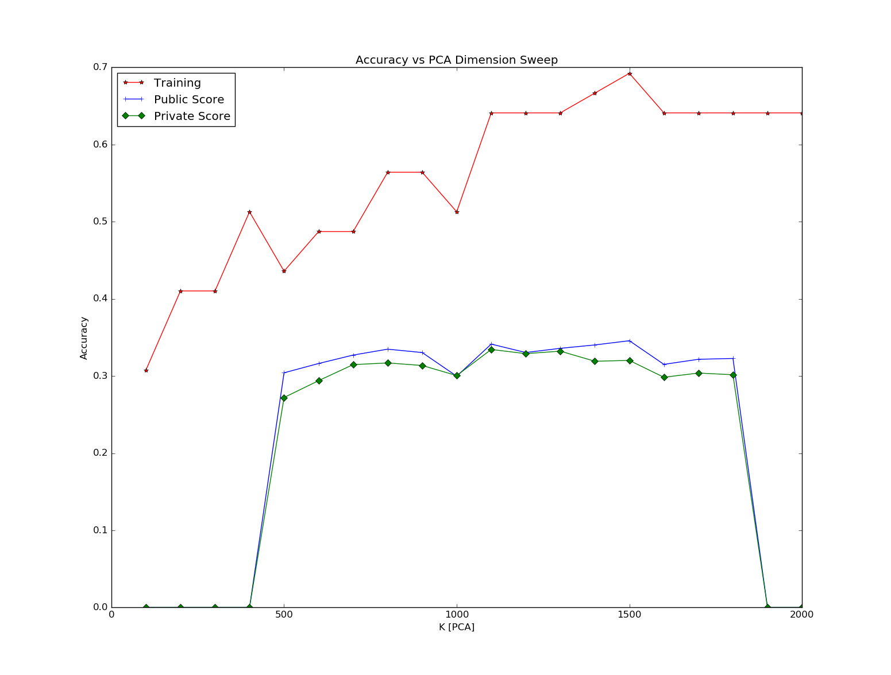

Introduction
============

The report is organized into two sections - Task 1 and Task 2. For task
1, the best performing method is method 5. Whereas, for task 2, the best
performing method is method 6.\
\
All of our methods were implemented in Python using the scikit-learn
package (version 0.17.1).\

Task 1
======

Method 1 - All projects are labeled successful
----------------------------------------------

We made a submission with all predictions set to 1 to see how many of
the projects were actually successful. Although we expected the score to
be around 47 % - 53 %, the score was actually  59% which means the no.
of successful and unsuccessful projects are not really equal.\
\

-   No. of successful projects is around 58%

Method 2 - KMeans on social and evolution data
----------------------------------------------

Next, we tried a simple KMeans on the social data with random
initialization. We got an accuracy of about  52%. The reason behind this
was the assumption that successful projects may have similar social
media response.\
\

-   It seems like the assumption was not correct for this dataset.

Method 3 - Graph donor threshold
--------------------------------

We then counted the number of donors each project had from the backer
network. Then we thresholded it at different values. We observed the
following:\

-   Threshold 40 - 53.063%

-   Threshold 30 - 53.829%

-   Threshold 20 - 54.705%

-   Threshold 1 - 58.096%

\

-   A few important things we learnt from this experiment is that there
    is no direct correlation between the number of donors a project had
    and whether it was successful. There are a few projects that were
    successful even with a single donor.

Method 4 - Random projection on graph + Spectral clustering
-----------------------------------------------------------

We cleaned the graph by removing all the donors who did not make any
contribution (i.e., donors who did not donate to any of the projects;
wonder why they were even there in the first place). This resulted in a
lesser sparse graph of size 1829 x 289344. This means there were 289344
unique donors and 368586 donations. We then performed random projection
on this graph to 300 dimensions. This was followed by performing
spectral clustering using the RBF kernel. We got a score of about  51%.\
\

-   We did not try projecting it to other dimensions. This was an early
    attempt to see if Random Projection can give some decent results. We
    didn’t spend much time on this because we thought other experiments
    might yield better results. There can be multiple reasons for this
    result - the projection into the 300 dimension space might have not
    preserved the distances and since Random Projection works as
    expected with probability less than 1, we should have tried multiple
    instances of projection.

Method 5 (Best Performing) - Similarity matrices on graph + Spectral clustering
-------------------------------------------------------------------------------

1.  We used the same cleaned graph as in the previous method. In
    addition, we removed all the donors who made just 1 donation as
    these donors does not contribute to any edge in our similarity
    matrix.

2.  On this graph, we tried spectral clustering using different
    similarity matrices. Let A be the set of all donors of project A,
    and B the set of all donors of project B. Then we can define the
    following similarity matrices -

    -   Matrix with entry 1 if there is at least one common donor
        between A and B, and 0 otherwise.

    -   Cardinality of Intersection between A and B, $A_{AB}=|A \cap B|$

    -   Cardinality of Intersection divided by Cardinality of Union,
        $A_{AB}= \frac{|A \cap B|}{|A \cup B|}$

    -   Cardinality of Intersection / Minimum,
        $A_{AB}=\frac{|A \cap B|}{min( |A|, |B| )}$

3.  In addition to the above, we also tried the RBF kernel.

4.  We tried to visualize the adjacency matrix to spot any pattern of
    connection/similarity between the projects. One of these
    visualizations is shown in fig. 1 (dimensions are 1829x1829, white
    corresponds to 1 and grey to 0):

     [Fig1: Adjacency Matrix(2a)]

5.  For Spectral clustering, we implemented each step of algorithm
    separately and tried to visualize two dimensions at a time in the
    spectral embedding which we get through different similarity
    matrices. Few of those scatter plots are shown below in fig. 2 -

     [Fig1: Spectral embedding pairwise
    plots for different dimensions]

    From these plots we can see that the projects start getting
    separated only in high dimensional space, but still it would be a
    hard task for any clustering algorithm to find two clusters.
    Moreover, we can see that out of the given 6 labeled projects, 4 are
    right inside the big center and the remaining 2 are out, but they
    both have different labels. So it’s hard to get a good accuracy in
    such a setting.\

    Next, we tried various clustering algorithms on these spectral
    embeddings -\

    1.  KMeans - We tried Kmeans under 3 different settings

        -   With number of clusters as 6 and initial points to start
            with were the 6 labels provided

        -   With number of clusters as 2 and initial points was the mean
            of 3 successful projects and mean of 3 unsuccessful
            projects.

        -   With number of clusters as 2 and random initialization.

    2.  GMM - Gaussian Mixture Model based clustering.

    3.  Agglomerative Clustering - This is similar to single link
        clustering where each point starts with its own cluster and at
        every iteration pair of clusters are merged together till we
        reach the desired number of clusters.

    The best performing setting was with similarity matrix 2a (1 if
    there is a common donor, and 0 otherwise), spectral embedding into
    202 dimensions, and KMeans with flipped centroids. That is, centroid
    of given successful projects as initial centroid of unsuccessful
    projects and centroid of given unsuccessful projects as initial
    centroid of successful projects. We did this as we observed that
    when we gave the centroids unchanged, there were a large number of 0
    predictions (unsuccessful projects) which gave us  40% accuracy.
    Obviously if we flipped the labels, we would get  60%. But instead,
    we flipped the initial centroids and it gave us the exact accuracy
    we expected, i.e.,  60%.

\

We think that this is the right direction for this task but there are
lot of parameters to tune for it get the best accuracy. We learned that
for any model to work properly, tuning parameters is both important and
hard. We think that the spectral clustering algorithm is getting stuck
in some local minima and we came up with couple of ways through which we
can take it out of that local minima:

1.  We see that one of the clusters in the 6 clusters we got through
    method 1a above has most of the points, which is not good. So we
    thought that if we randomly drop some edges between the points in
    this cluster, it might help the algorithm to perform better overall.

2.  We also thought that there might be a few outliers which are making
    it difficult for the clustering algorithm to converge and removing
    those might help.

3.  Some of the given semi-supervised labels may be outliers.

Task 2
======

All the methods on task 2 are performed on the description data.\

Method 1 - PCA + Spectral clustering
------------------------------------

We performed PCA on the description data by calculating the top 1200
eigenvectors using SVD. This was followed by spectral clustering using
the RBF kernel. We tried two different gamma values for the RBF kernel
(1 and 0.2). The gamma value of 0.2 yielded a score of  16.5%.\
\

-   PCA may not really work well on sparse matrices.

Method 2 -  Random Projection + KMeans
--------------------------------------

We then used Random Projection to reduce the dimensionality of the
description data to 100 dimensions. Then we used KMeans with 13 randomly
initialized centroids. This yielded a score of  14.5%.\
\

-   We did not try other dimension values, but 100 dimensions may be too
    low and which is why the method may have performed so poorly.

-   Another reason could be the way we assigned the labels. There were a
    few labels where there was no clear winner and the choice to assign
    labels was arbitrary. We realized we needed to find a method which
    is more stable from run to run and wouldn’t give us much choice in
    assigning the labels.

Method 3 - Random Projection + Gaussian Mixture Model
-----------------------------------------------------

We then tried Random Projection to 1200 dimensions followed by GMM
clustering with random initializations. This gave us a score of  13%.\
\

-   Again, here we had to choose labels arbitrarily.

Method 4 - Similarity matrices + Spectral embedding + Gaussian Mixture Model
----------------------------------------------------------------------------

We then tried constructing different similarity matrices as follows.

-   RBF

-   Cosine, $A_{AB}= \frac{\vec{A} . \vec{B}}{|A| . |B|}$ , where
    $\vec{A}$ and $\vec{B}$ are description vectors of projects A and B

This was followed by spectral embedding and then GMM clustering (instead
of KMeans). It did not perform as well as the previous methods even
after trying several different parameters for spectral embedding (no. of
eigenvectors and value of gamma in RBF kernel).\
\

-   The main takeaway from this was that constructing Similarity matrix
    and doing Spectral Clustering might not be the best way for this
    task because projects might vary across only few features out of
    those 8000 features given in description file, and when we construct
    similarity matrix we might lose that variation as large number of
    similar features might just mask off those few important features.

Method 5 - KMeans with centroids given explicitly
-------------------------------------------------

We calculated the centroids with the mean of 3 projects given for each
class and then initialized the KMeans algorithm with these points. The
assumption here is that the KMeans algorithm may converge to clusters
with mean close to these initial centroids. This method performed really
well as we expected, with an accuracy of  32%.\
\

-   KMeans when initialized randomly performs very poorly as it more
    likely to converge to a local minima. By giving it explicit
    initialization, we force it to converge to those minima that are
    close to global minima.

Method 6 (Best) - PCA + KMeans with centroids given explicitly
--------------------------------------------------------------

We performed the same method as before with a slight tweak. We first
reduced the dimensionality of the data using PCA. Then we used KMeans
with explicit centroids. This method seemed to have performed the best
out of all methods that we tried.

 [Fig3: PCA sweep]

As shown in the graph in fig. 3, we sweeped several values for
projection dimension k (from 500 to 1700) for PCA. The best score we got
was  34.5% at k=1500. *The values shown to be 0 in the graph are not
really zero. We did not sample those values*.\

\

-   Contrary to what we initially thought, PCA actually seemed to help
    us in clustering. The reason behind this could be that since PCA’s
    objective is variance maximization it helps in reducing the noise.
    This noise reduction can help the clustering algorithm a lot in
    finding a better solution.

